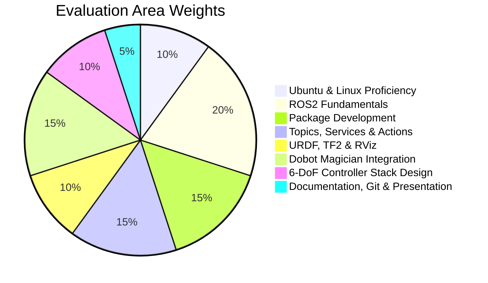

# Parallel Learning Activities & Evaluation Rubric

---

## 🕒 Parallel Learning Activities (Daily Routine)

 | Activity | Suggested Duration | Recommended Tasks & Resources | 
 | ---- | ---- | ---- | 
 | **Ubuntu Practice** | 30 minutes | Practice command shortcuts, script automation patterns, and environment setups. | 
 | **ROS2 CLI Practice** | 30 minutes | Monitor node operations, inspect topic rates, trace active services/actions, and output parameters. | 
 | **Git & GitHub Workflows** | 20 minutes | Commit daily work with descriptive logs, handle merge conflicts, push logs to remote branches, and manage pull requests. | 
 | **Technical Documentation** | 20 minutes | Read official documentation updates (e.g., [ROS2 Index](https://index.ros.org/), [MoveIt2 Tutorials](https://moveit.picknik.ai/)). | 
 | **Robotics Research Reading** | 30 minutes | Read academic publications covering surgical robotics, kinematics solvers, path planning, and safety architectures. | 
 | **Code Review** | 20 minutes | Read, debug, and review open-source robotics code repositories on GitHub. | 
 | **Lab Notebook / Daily Log** | 15 minutes | Update your personal engineering log detailing daily findings, error codes encountered, and resolution steps. | 

---

## 📊 Final Evaluation Rubric

### 📋 Category Performance Standards

[//]: # (heading_4 is not supported)

- **Objective**: Check environment config capabilities, static IP setups, process command tools, and automation script structures.

- **Rubric**:

	- **Excellent (90-100%)**: Independently writes complex bash automation scripts; troubleshoots SSH network setups and permission configurations with zero guidance.

	- **Satisfactory (70-89%)**: Understands directory structure, basic permissions, and processes; writes simple automation scripts.

	- **Needs Improvement (<70%)**: Struggles with command line navigation and standard configurations.

[//]: # (heading_4 is not supported)

- **Objective**: Evaluate DDS middleware, workspace setup, client library systems (RCL), and workspace packages build structures.

- **Rubric**:

	- **Excellent (90-100%)**: Solid understanding of DDS parameters (QoS, latency control); compiles complex workspaces without errors.

	- **Satisfactory (70-89%)**: Can initialize workspaces, configure standard overlays, and build nodes using `colcon`.

	- **Needs Improvement (<70%)**: Difficulties compiling workspaces or resolving basic package dependencies.

[//]: # (heading_4 is not supported)

- **Objective**: Check capability to create Python and C++ package setups, resolve links, build options, and configure `package.xml` settings.

- **Rubric**:

	- **Excellent (90-100%)**: Correctly configures complex package dependency hierarchies with custom libraries and entry points across C++ and Python.

	- **Satisfactory (70-89%)**: Creates packages, defines dependencies, and uses basic build flags like `-symlink-install`.

	- **Needs Improvement (<70%)**: Struggles with CMake syntax or Python setup script modifications.

[//]: # (heading_4 is not supported)

- **Objective**: Evaluate capability to design and implement publish-subscribe loops, service configurations, parameters, and action interfaces.

- **Rubric**:

	- **Excellent (90-100%)**: Implements dynamic actions with feedback loops and parallel executor pools; writes clean, thread-safe asynchronous service clients.

	- **Satisfactory (70-89%)**: Develops basic publishers, subscribers, services, and parameters.

	- **Needs Improvement (<70%)**: Struggles to link callback threads or fails to build custom interface types.

[//]: # (heading_4 is not supported)

- **Objective**: Check coordinate transform trees, dynamic coordinate publishers, URDF configuration file layout, and model visualizations.

- **Rubric**:

	- **Excellent (90-100%)**: Designs complex, multi-link URDF files with detailed collision models; builds custom TF trees and resolves kinematic transformation limits.

	- **Satisfactory (70-89%)**: Visualizes simple robot models in RViz; creates static transforms.

	- **Needs Improvement (<70%)**: Unable to construct valid coordinate transformation branches or errors out on URDF syntax.

[//]: # (heading_4 is not supported)

- **Objective**: Evaluate physical hardware interfacing, serial API write execution, dynamic coordinate transformation, and control apps.

- **Rubric**:

	- **Excellent (90-100%)**: Executes robust, collision-free pick-and-place routines; handles serial timeouts and sensor errors.

	- **Satisfactory (70-89%)**: Can connect to Dobot via serial port and execute basic PTP commands.

	- **Needs Improvement (<70%)**: Struggles with hardware drivers or serial link configuration.

[//]: # (heading_4 is not supported)

- **Objective**: Evaluate understanding of architectural structures, safety loops, state controls, planner interfaces, and control strategies.

- **Rubric**:

	- **Excellent (90-100%)**: Designs highly detailed, production-grade 6-DoF control stack plans showing complete safe loop limits and controller interfaces.

	- **Satisfactory (70-89%)**: Explains the components of a surgical robot architecture and draw basic layout paths.

	- **Needs Improvement (<70%)**: Cannot explain kinematics integration or fails to outline standard safety modules.

[//]: # (heading_4 is not supported)

- **Objective**: Check quality of markdown reports, comment structure, clean git history, and presentation delivery.

- **Rubric**:

	- **Excellent (90-100%)**: Comprehensive, publication-grade documentation; clean commit history; professional and clear presentation structure.

	- **Satisfactory (70-89%)**: Completes homework logs; maintains standard repository layouts.

	- **Needs Improvement (<70%)**: Inadequate logs, undocumented codebase, or unstructured project submissions.

