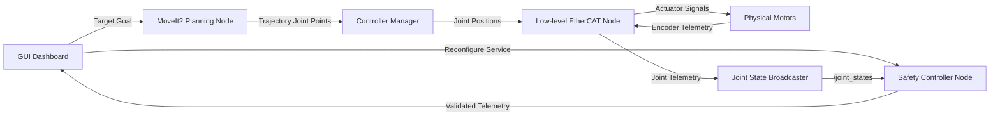

# Day 14: 6-DoF Taurean Surgical Robot Stack (Practical)

### 📌 TL;DR
Practical project layout design for a 6-DoF surgical robot controller stack. You will map out the node communication architecture, define interfaces, configure real-time controllers, and set up safety collision layers.

---

### 🛠️ Practical Architecture Components



#### 1. Low-level Driver Interface (Practical)
* **Goal**: Write a C++ node `ethercat_motor_driver` communicating directly with motor controllers (like Maxon EPOS4) over a CAN/EtherCAT fieldbus interface.
* **Frequency**: Must run on a real-time thread loop at $1000\text{ Hz}$ (1ms tick rates) using `PREEMPT_RT` patch schedules.
* **Payload**: Receives target position values, writes to control word registries, and reads encoder counts.

#### 2. Controller Manager Configuration (Practical)
* Use the ROS2 Control framework (`ros2_control`).
* Create a config file `controllers.yaml` to configure controller containers:
  * **Joint State Broadcaster**: Publishes joint angles to `/joint_states` for RViz.
  * **Joint Trajectory Controller**: Receives spline target trajectories from MoveIt2 and performs real-time interpolation to generate command signals.

#### 3. Safety Supervisor Node (Practical)
* **Goal**: Write a Python node `safety_supervisor` checking robot kinematics state variables.
* **Tasks**:
  * Subscribe to `/joint_states`.
  * Calculate Forward Kinematics (FK) to find 3D cartesian tools position.
  * If the tool moves out of bounds (virtual safety box), or if velocities exceed thresholds:
    * Trigger a service request `/estop` to cut motor power immediately.

---

### 🛠️ Hands-on Implementation Exercise
* Create the configuration package structure:
  ```bash
  cd ~/ros2_ws/src
  ros2 pkg create --build-type ament_cmake taurean_control_stack --dependencies rclcpp ros2_control controller_manager
  ```
* Define custom service interfaces inside `taurean_interfaces/srv/`:
  * `EStop.srv` (contains a trigger status input and confirmation output).
  * `SetSafetyLimits.srv` (defines Cartesian bounding box dimensions).

---

### 📝 Assignment
* **Task**: Design the modular software architecture document (`surgical_robot_design.md`) outlining node responsibilities, communication interfaces (topics, service schemas, actions), low-level parameters, and specific safety rules.
